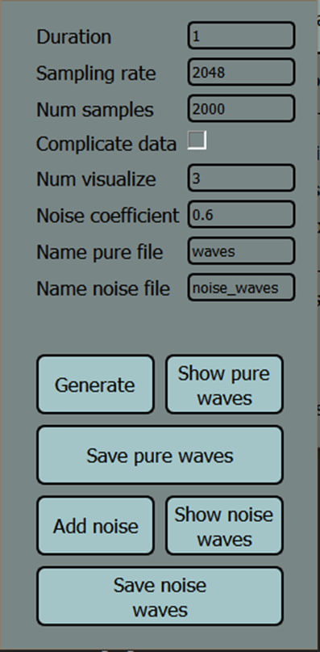
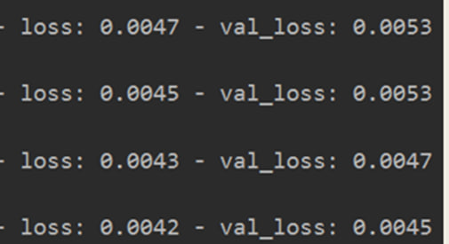

# denoising_autoencoder
My thesis on the topic "Processing of hydroacoustic signals by an autoencoder with multilevel noise reduction"

Розроблена програма повинна виконувати такі функції: створення звукових сигналів, додання шуму до створених звуків, налаштування параметрів автоенкодеру, навчання нейромережі, перегляд результату роботи автоенкодера.

Робота полягає в обробці звукових сигналів з метою пониження шуму.
Для виконання цієї роботи я використав автоенкодер.

**Автоенкодер**

Автоенкодер - це нейронна мережа прямого розповсюдження, яка відновлює вхідний сигнал на виході. Усередині нього є прихований шар, який є закодованим виглядом вхідних даних що має меншу розмірність.

У створеній програмі використовується автоенкодер для зменшення шуму в гідроакустичних сигналах. На вхід до автоенкодера подаються зашумлені дані, а на виході порівнюються з даними без шуму. Це необхідно для того, аби модель зменшувала кількість ознак сигналу, та зберігала лише найважливіші.

**Багаторівневий автоенкодер**

Якщо ми отримуємо на вхід неоднорідні дані зі складними шаблонами, то одного автоенкодера може бути недостатньо. Щоб вирішити цю проблему ми можемо використати багаторівневий автоенкодер.
Багаторівневий автоенкодер це кілька автоенкодерів, розташованих один над одним. Сигнал який іде на вхід кожного автоенкодера модулюється з данними які були попереду

**Діаграма прецендентів**

До програмного продукту були поставлені певні вимоги, в ході роботи була зроблена декомпозиція, яку можна побачити на діаграмі.
Система має одного користувача, та виконує вузький спектр задач, націлених на обробку сигналів та навчання нейронних мереж.

**Архітектура моделі**

На цьому зображені можна побачити архітектуру нейронної мережі, при наявному датасетів було побудовано таку модель з 2 рівнями, у програмі використовується 2 шари кодувальника, та 2 шари енкодера

**Інтерфейс**

Інтерфейс являє собою два вікна, одне – головне, де відбувається налаштування автоенкодера, а друге – вікно для створення та обробки сигналів. У цьому вікні є можливість детально налаштовувати параметри звуку, та можна вибрати інтенсивність шуму.

**Створення та обробка монохромного звуку**

Далі зображено приклади створених звукових сигналів. Сигнал має форму синусоїди, з різною частотою, що дає змогу генерувати велику кількість різноманітних даних. Також на слайді можна побачити приклад зашумлених даних. В даному випадку використовується Гаусівський шум, тобто до звуку додається шум з густиною ймовірності рівну ймовірності нормального розподілу. 

На наступних зображеннях показано приклад створення багаточастотних сигналів, це робиться додаванням до однієї синусоїди іншої. 

**Результат роботи**

Далі можна побачити результат роботи автоенкодера, зліва знаходяться чисті дані, по центру – зашумлені, а справа – зображення сигналу який відновила нейромережа. Мірою якості може слугувати метрика val_loss, ця метрика вказує наскількі автоенкодер вдало відновлює тестові дані, які не брали участь у тренуванні моделі. Також мірою якості може бути коефіцієнт кореляції – вона вказує щільність зв’язку між чистим та відновленим сигналом. 

